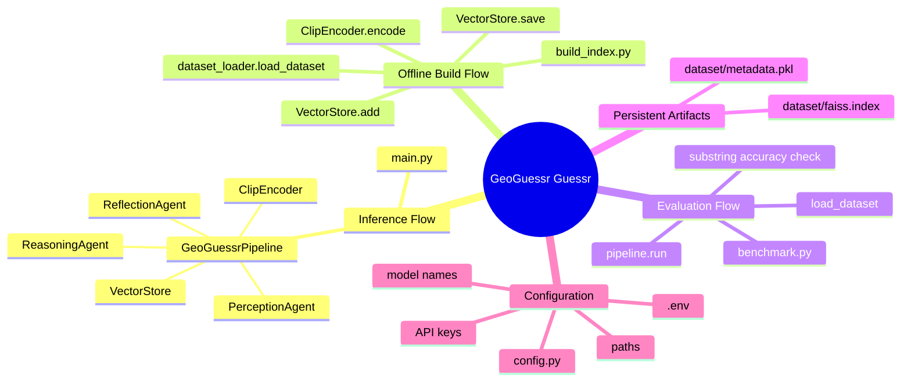
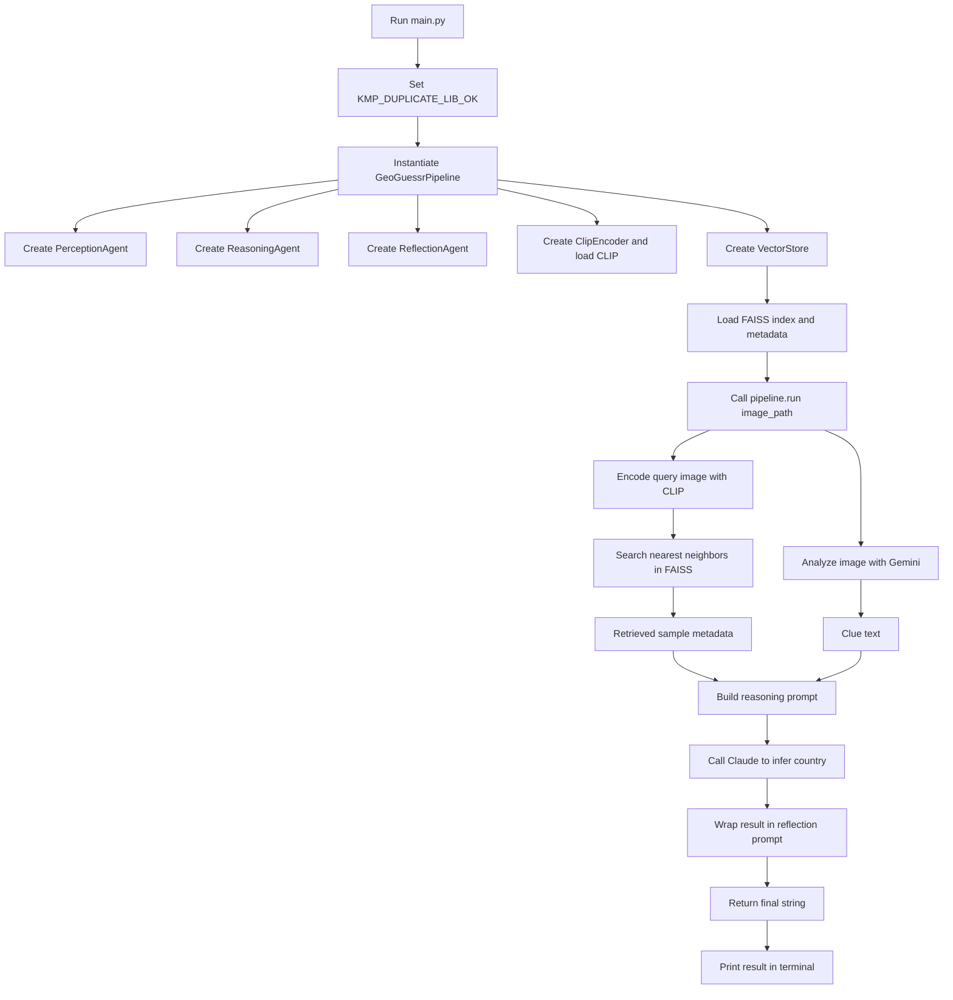
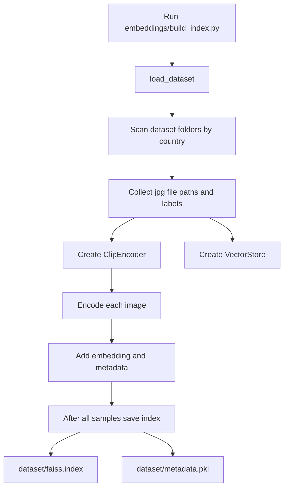
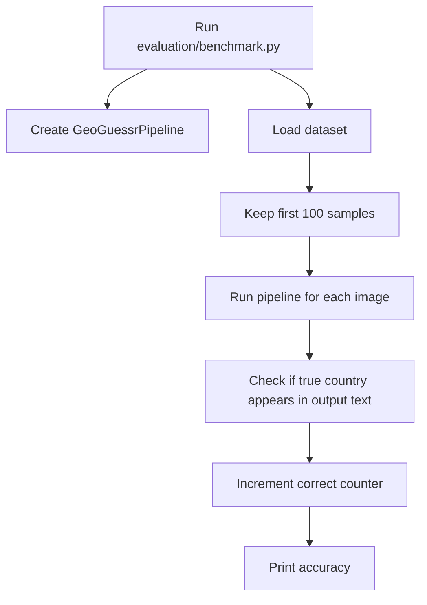

# GeoGuessr Guessr

Become the geoguesr boss (like Saarang) of your gang.

> This is a sequential Python pipeline that combines CLIP-based visual retrieval, Gemini-based clue extraction, and Claude-based reasoning to guess the most likely country from a GeoGuessr image.

## Pre-requisites
Follow: [Pre-req steps](prereqs.md)

### Virtual Environment
1. Create a virtual environment with Python 3.11:
    ```
    uv venv --python 3.11
    ```
2. Activate it: `source .venv/bin/activate`
3. Now verify python version: `python --version`
    - Should return version a version of 3.11
4. Verify path: `which python`
    - Should return a path inside this virtual environment

## Table of Contents

1. [Purpose](#purpose)
2. [Scope](#scope)
3. [Project at a Glance](#project-at-a-glance)
4. [Main Runtime Flow](#main-runtime-flow)
5. [Offline Index-Building Flow](#offline-index-building-flow)
6. [Evaluation Flow](#evaluation-flow)
7. [Folder Breakdown](#folder-breakdown)
8. [File-by-File Explanation](#file-by-file-explanation)
9. [Function and Method Catalog](#function-and-method-catalog)
10. [Data and Artifacts](#data-and-artifacts)
11. [What Is Intentionally Ignored](#what-is-intentionally-ignored)
12. [Accurate Current-State Summary](#accurate-current-state-summary)

## Purpose

This document explains the actual working flow of the `geoguessr-guessr` project as it exists now.

It focuses on:

- files that participate in a real executable flow
- functions and methods that are actually invoked by those flows
- artifacts that the running project depends on

## Scope

There are three real flows in this repository:

1. Single-image inference flow from `main.py`
2. Offline vector-index build flow from `embeddings/build_index.py`
3. Manual benchmark flow from `evaluation/benchmark.py`

The current architecture is retrieval-augmented:

- CLIP creates image embeddings
- FAISS retrieves similar stored images
- Gemini extracts visual clues from the input image
- Claude reasons over clues plus retrieval results
- a reflection stage wraps the reasoning text, but does not yet call a model

## Project at a Glance



## Main Runtime Flow

This is the flow used when you run:

```bash
uv run python main.py
```

### Runtime Flow Diagram



### Step-by-Step Flow:

1. `main.py` starts the process.
2. It sets `KMP_DUPLICATE_LIB_OK=TRUE` before heavy model usage.
3. It imports and instantiates `GeoGuessrPipeline`.
4. `GeoGuessrPipeline.__init__()` creates all major components.
5. During initialization, it loads the persisted FAISS index and metadata into memory.
6. `main.py` selects an input image path. In the checked-in version, this is a hardcoded absolute path pointing to `image9.png`.
7. `pipeline.run(image_path)` begins inference.
8. The image is encoded into a CLIP embedding.
9. That embedding is used to retrieve the nearest stored images from FAISS.
10. The same input image is sent to Gemini for clue extraction.
11. The clue text and retrieval results are sent together to Claude.
12. Claude produces a country guess with reasoning.
13. The reasoning text is passed into `ReflectionAgent.reflect()`.
14. The reflection stage does not call a model. It only formats the reasoning into a review-style prompt.
15. The final returned text is printed.

## Offline Index-Building Flow

This flow is used to create the vector search artifacts.

You run it with:

```bash
uv run python embeddings/build_index.py
```

### Index Build Diagram



### Step-by-Step Narrative

1. `load_dataset()` scans the dataset directory.
2. Each country folder becomes a label source.
3. Each `.jpg` image becomes one sample dictionary.
4. `ClipEncoder` creates a CLIP embedding for each sample image.
5. `VectorStore.add()` stores the embedding and aligned metadata.
6. After all samples are processed, `VectorStore.save()` writes:
   - `dataset/faiss.index`
   - `dataset/metadata.pkl`

These files are later consumed by the runtime inference pipeline.

## Evaluation Flow

This flow is a simple benchmark script.

You run it with:

```bash
uv run python evaluation/benchmark.py
```

### Evaluation Diagram



### Important Note

This is only a rough metric.

It does not parse a structured prediction field. It only checks whether the true country name appears somewhere in the returned text.

## Folder Breakdown

## Root

Contains:

- entrypoint
- configuration
- dependency definitions
- sample image assets
- project docs

Actively relevant root files:

- `main.py`
- `config.py`
- `pyproject.toml`
- `requirements.txt`
- `uv.lock`
- `image9.png`

## `pipelines/`

Contains the top-level orchestration layer.

Actively relevant file:

- `pipelines/langgraph_pipeline.py`

## `agents/`

Contains the agent-like modules responsible for:

- perception
- reasoning
- reflection

Actively relevant files:

- `agents/perception_agent.py`
- `agents/reasoning_agent.py`
- `agents/reflection_agent.py`

## `embeddings/`

Contains image embedding logic and the index build script.

Actively relevant files:

- `embeddings/clip_encoder.py`
- `embeddings/build_index.py`

## `retrieval/`

Contains vector storage and nearest-neighbor search logic.

Actively relevant file:

- `retrieval/vector_store.py`

## `dataset/`

Contains:

- dataset scanning logic
- saved vector index
- saved metadata

Actively relevant files:

- `dataset/dataset_loader.py`
- `dataset/faiss.index`
- `dataset/metadata.pkl`

## `evaluation/`

Contains the benchmark script.

Actively relevant file:

- `evaluation/benchmark.py`

## File-by-File Explanation

## `main.py`

### Responsibility

Acts as the single-image runtime entrypoint.

### Active Flow

- sets an environment variable for local runtime stability
- constructs the pipeline
- chooses one image path
- runs the pipeline
- prints the returned output

### Active Function

#### `main()`

Responsibilities:

- instantiate `GeoGuessrPipeline`
- set the input image path
- call `pipeline.run(image)`
- print the result

### Important Notes

- It currently uses a hardcoded absolute path to `image9.png`.
- The commented alternative implementations in this file are not active.

## `config.py`

### Responsibility

Centralizes all environment-based settings and path constants.

### Active Runtime Variables

#### API keys

- `GOOGLE_API_KEY`
- `ANTHROPIC_API_KEY`
- `HF_TOKEN`

#### Paths

- `DATASET_PATH`
- `INDEX_PATH`
- `METADATA_PATH`

#### Model names

- `CLIP_MODEL`
- `GEMINI_MODEL`
- `ANTHROPIC_MODEL`

### Runtime Role

- `PerceptionAgent` reads Google model config and API key
- `ReasoningAgent` reads Anthropic model config and API key
- `VectorStore` reads FAISS and metadata paths
- `dataset_loader` reads `DATASET_PATH`
- `ClipEncoder` reads `CLIP_MODEL`

## `pipelines/langgraph_pipeline.py`

### Responsibility

Coordinates the complete inference chain.

### Important Accuracy Note

Despite its name, this file is not currently using LangGraph.

`StateGraph` is imported but never used.

### Class

#### `GeoGuessrPipeline`

Owns the system-level components:

- `PerceptionAgent`
- `ReasoningAgent`
- `ReflectionAgent`
- `ClipEncoder`
- `VectorStore`

### Active Methods

#### `__init__()`

Responsibilities:

- create the perception agent
- create the reasoning agent
- create the reflection agent
- create the CLIP encoder
- create the vector store
- load the saved FAISS index and metadata

#### `run(image_path)`

Responsibilities:

- encode the query image
- retrieve similar stored images
- generate clue text from the image
- infer country using clues and retrieval context
- wrap the reasoning result in a reflection prompt
- return the final string

### Internal Sequence

1. `self.encoder.encode(image_path)`
2. `self.store.search(emb)`
3. `self.perception.analyze(image_path)`
4. `self.reasoning.infer_location(clues, retrieved)`
5. `self.reflection.reflect(reasoning)`

## `agents/perception_agent.py`

### Responsibility

Extracts GeoGuessr-style clues from the image using Gemini.

### Class

#### `PerceptionAgent`

### Active Methods

#### `__init__()`

Responsibilities:

- validate presence of a Google/Gemini API key
- construct `genai.Client`
- store configured model name

Failure mode:

- raises `ValueError` if neither `GOOGLE_API_KEY` nor `GEMINI_API_KEY` is available

#### `analyze(image_path)`

Responsibilities:

- open the image using PIL
- send the image plus a clue-extraction instruction to Gemini
- return plain text clue output

### Output Type

Returns a string containing clues such as:

- language
- road signs
- vegetation
- architecture
- regional hints

## `agents/reasoning_agent.py`

### Responsibility

Takes textual clues and retrieval results, then infers the most likely country using Anthropic.

### Class

#### `ReasoningAgent`

### Active Methods

#### `__init__()`

Responsibilities:

- validate presence of the Anthropic API key
- construct `anthropic.Anthropic`
- store configured model name

Failure mode:

- raises `ValueError` if `ANTHROPIC_API_KEY` is missing

#### `infer_location(clues, retrieved)`

Responsibilities:

- construct a prompt using:
  - clue text
  - retrieved sample metadata
  - country-inference instructions
- send the prompt to Anthropic
- return the first text block from the response

Special error handling:

- if the configured model is unavailable for the current account, it catches `anthropic.NotFoundError`
- it queries available model IDs
- it raises a clearer `ValueError` with those model names

## `agents/reflection_agent.py`

### Responsibility

Acts as an intended reflection stage, but currently only formats text.

### Class

#### `ReflectionAgent`

### Active Method

#### `reflect(reasoning)`

Responsibilities:

- place the reasoning text inside a reflection prompt template
- return that prompt string

### Important Accuracy Note

This method does not call a model.

So the final pipeline output is not a truly revised answer. It is a review-style prompt containing the reasoning text.

## `embeddings/clip_encoder.py`

### Responsibility

Converts an image into a CLIP embedding for similarity search.

### Class

#### `ClipEncoder`

### Active Methods

#### `__init__()`

Responsibilities:

- choose runtime device:
  - `cuda` if available
  - otherwise `cpu`
- load the CLIP model
- load the CLIP processor

#### `encode(image_path)`

Responsibilities:

- open image and convert it to RGB
- preprocess the image with `CLIPProcessor`
- run `get_image_features`
- return the resulting embedding as a NumPy vector

### Output

- one 512-dimensional embedding vector per image

## `embeddings/build_index.py`

### Responsibility

Offline script that builds the retrieval index.

### Active Flow

- load dataset samples
- create encoder
- create vector store
- encode each sample image
- store embedding and metadata
- save artifacts

### Important Note

This file has top-level executable code, not a `main()` function.

If imported, it would execute the indexing logic immediately.

## `retrieval/vector_store.py`

### Responsibility

Stores embeddings and performs nearest-neighbor retrieval using FAISS.

### Class

#### `VectorStore`

### Active Methods

#### `__init__(dim=512)`

Responsibilities:

- create an in-memory FAISS index using `IndexFlatL2`
- initialize the metadata list

#### `add(embedding, meta)`

Responsibilities:

- add one embedding to FAISS
- append the corresponding metadata entry

#### `save()`

Responsibilities:

- save the FAISS index to `INDEX_PATH`
- pickle metadata to `METADATA_PATH`

#### `load()`

Responsibilities:

- load FAISS index from disk
- load metadata from disk

#### `search(embedding, k=5)`

Responsibilities:

- search for nearest neighbors
- collect matching metadata records
- return those metadata records as a list

### Important Notes

- Distances are computed but ignored.
- The method default is `k=5`.
- `config.TOP_K` exists but is not wired into this method call path.

## `dataset/dataset_loader.py`

### Responsibility

Converts a country-folder image dataset into a Python list of sample dictionaries.

### Active Function

#### `load_dataset()`

Responsibilities:

- list folders inside `DATASET_PATH`
- treat each folder as a country label
- scan each folder for `.jpg` images
- build records of the form:

```python
{"path": "...", "country": "..."}
```

### Used By

- `embeddings/build_index.py`
- `evaluation/benchmark.py`

## `dataset/faiss.index`

### Responsibility

Stores the serialized FAISS index used for retrieval.

### Observed Current-State Facts

- total vectors: `49997`
- vector dimension: `512`
- distance type: L2

### Used By

- `VectorStore.load()`
- `VectorStore.search()`

## `dataset/metadata.pkl`

### Responsibility

Stores metadata aligned positionally with the FAISS vectors.

### Observed Current-State Facts

- total records: `49997`
- number of countries represented: `124`
- each record contains:
  - `path`
  - `country`

Example shape:

```python
{"path": "dataset/geoguessr/Bhutan/canvas_1629262074.jpg", "country": "Bhutan"}
```

### Important Note

The stored metadata points at `dataset/geoguessr/...` image paths, but that raw dataset directory is not currently present in this workspace.

That means:

- inference can still use the saved index artifacts
- rebuilding and benchmarking need the raw dataset restored

## `evaluation/benchmark.py`

### Responsibility

Runs a simple benchmark over the first 100 dataset samples.

### Active Flow

- create `GeoGuessrPipeline`
- load first 100 dataset samples
- run pipeline on each image
- count a prediction as correct if the true country appears inside output text
- print final accuracy

### Important Note

Like `build_index.py`, this file executes at import time because its logic is top-level.

## Function and Method Catalog

This section lists only functions and methods that are part of an active project flow.

| File | Function / Method | Role in Flow |
| --- | --- | --- |
| `main.py` | `main()` | starts single-image inference |
| `pipelines/langgraph_pipeline.py` | `GeoGuessrPipeline.__init__()` | builds and loads the system |
| `pipelines/langgraph_pipeline.py` | `GeoGuessrPipeline.run(image_path)` | orchestrates inference |
| `agents/perception_agent.py` | `PerceptionAgent.__init__()` | sets up Gemini client |
| `agents/perception_agent.py` | `PerceptionAgent.analyze(image_path)` | extracts image clues |
| `agents/reasoning_agent.py` | `ReasoningAgent.__init__()` | sets up Anthropic client |
| `agents/reasoning_agent.py` | `ReasoningAgent.infer_location(clues, retrieved)` | infers most likely country |
| `agents/reflection_agent.py` | `ReflectionAgent.reflect(reasoning)` | wraps reasoning in review prompt |
| `embeddings/clip_encoder.py` | `ClipEncoder.__init__()` | loads CLIP model and processor |
| `embeddings/clip_encoder.py` | `ClipEncoder.encode(image_path)` | creates image embedding |
| `retrieval/vector_store.py` | `VectorStore.__init__(dim=512)` | creates FAISS index and metadata list |
| `retrieval/vector_store.py` | `VectorStore.add(embedding, meta)` | stores one embedding and metadata |
| `retrieval/vector_store.py` | `VectorStore.save()` | persists index and metadata |
| `retrieval/vector_store.py` | `VectorStore.load()` | loads index and metadata |
| `retrieval/vector_store.py` | `VectorStore.search(embedding, k=5)` | returns nearest metadata records |
| `dataset/dataset_loader.py` | `load_dataset()` | scans dataset into sample records |

## Data and Artifacts

## Runtime Inputs

- `.env`
- `image9.png` or any other chosen query image
- `dataset/faiss.index`
- `dataset/metadata.pkl`

## Runtime Outputs

- terminal text printed by `main.py`

Current output shape:

- a review-style prompt
- followed by the reasoning text from Anthropic

## Offline Build Outputs

- `dataset/faiss.index`
- `dataset/metadata.pkl`

## Evaluation Output

- printed scalar accuracy value

## Accurate Current-State Summary

The repository is currently a retrieval-augmented country-prediction system with three practical layers:

1. image embedding and similarity retrieval
2. multimodal clue extraction
3. text-based country reasoning

The actual decision is made in `ReasoningAgent.infer_location()`.

The project is conceptually structured as a multi-agent pipeline, but in its current state:

- it is not truly using LangGraph
- it does not yet perform a real reflection-model pass
- it relies on a prebuilt FAISS index for retrieval


I will have to make this a more robust system to implement the above.

It might seem like an overkill, but it is one of the ways I can learn and understand what other real-life use cases arise out of this and can work on them.